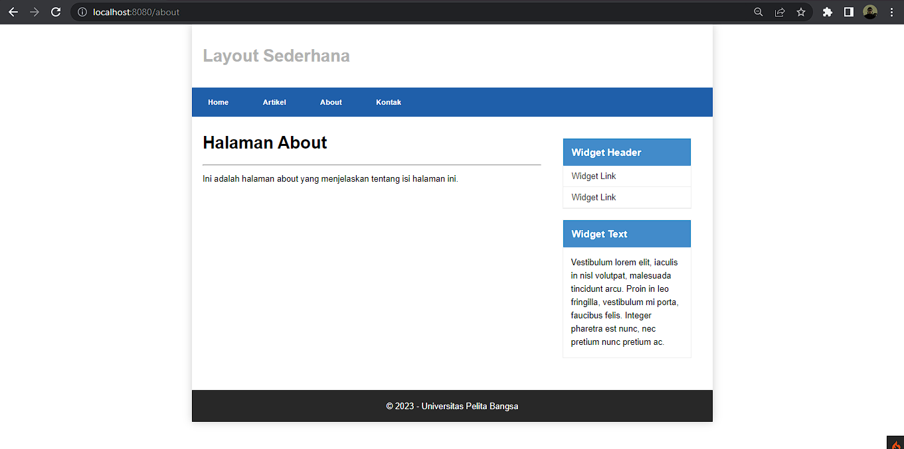

# Lab7Web-CodeIgniter

# PHP-CodeIgniter

This project is an assignment from my class
#### NIM : 312110103
#### Kelas : TI.21.A2
#### MatKul : Pemrograman Web 2

### Latihan
Setelah Mendownload CodeIgniter Pastikan Versi PHP Kalian di atas 7.3
### File
Salin file ke folder C:/xampp/htdocs/lab11_ci/, kemuadian setelah folder codeigniter di salin, ubah nama file menjadi ci4
### Jalankan Kode CLi
Setelah itu buka cli di xampp dan jalankan kode seperti di gambar
### PHP SPARK
Pertama cari file lab11_ci menggunakan cd,  
php spark untuk mengecek bahwa CodeIgniter sudah terinstall

### PHP SPARK SERVE
gunakan php spark serve untuk memulai virtual host CodeIgniter

### Selesai, Lanjut ke kode Layout
Masukan File header dan Footer di app/views/template
### Hasil
Code Igniter

### Layout

